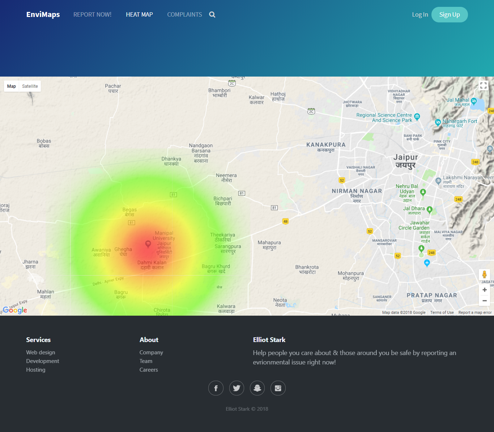
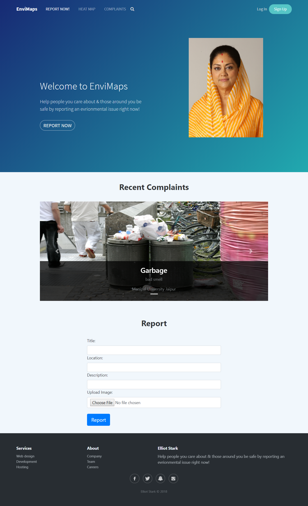

# Envimaps

### Contributers
- [Ackshay Jain](https://github.com/ackshayjain)
- [Abhishek Chaudhary](https://github.com/AbhishekChd)
- [Saurabh Jindal](https://github.com/saurabh-jindal)

### Requirements
- Django 1.8
- Python 2.7
- Pillow
- requests

### Run commands

```python
# with python manage.py
makemigrations
migrate
collectstatic
runserver
```

### Heatmap


### Home Page



### [Project Video](https://github.com/ackshayjain/envimaps2/blob/master/ElliotStark%20Rajasthan%20Hackathon%204.0%20(%20720%20X%201280%20).mp4)


